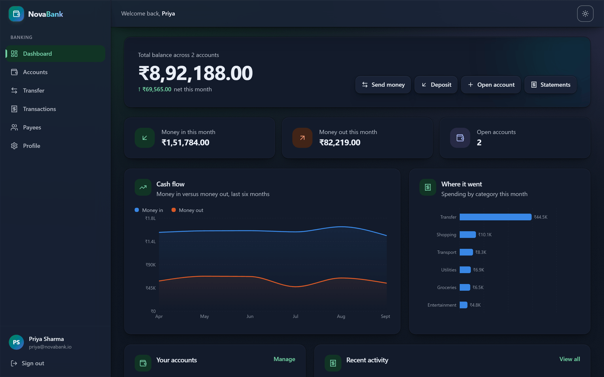
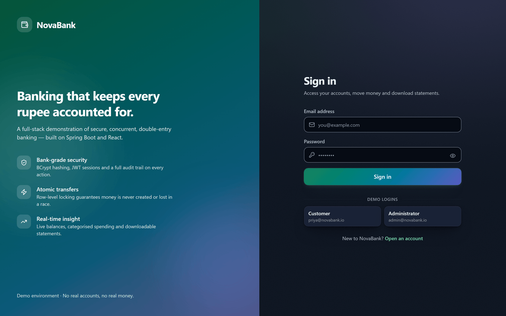
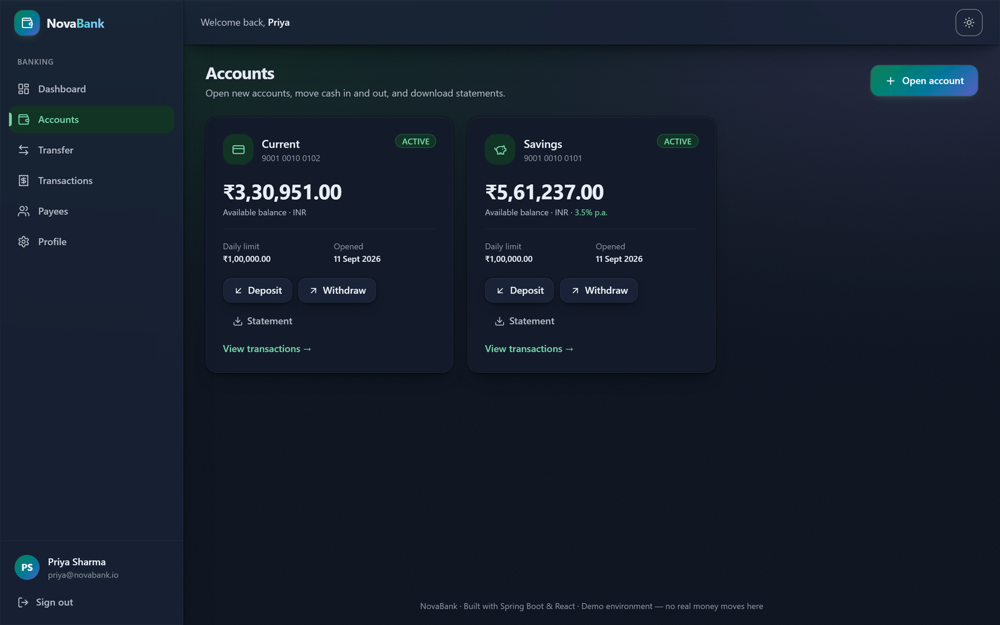
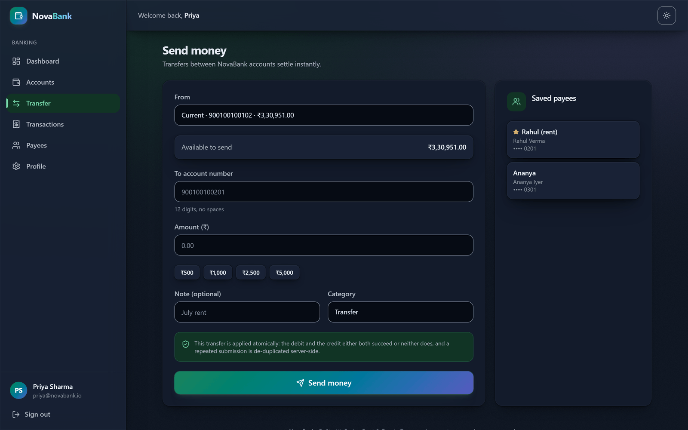
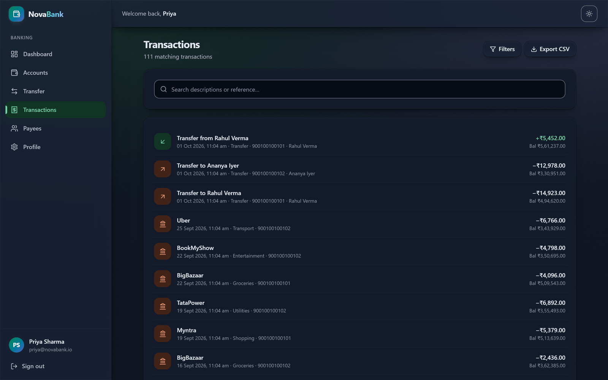
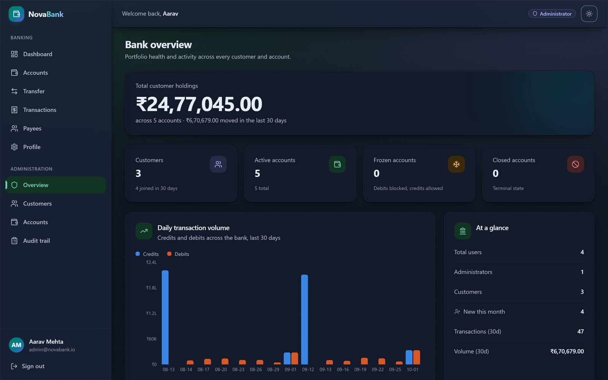
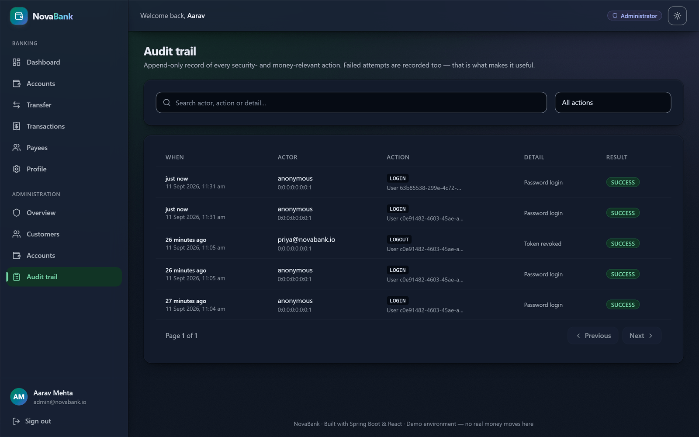

<h1 align="center">NovaBank</h1>

<p align="center">
  <b>A full-stack banking platform where the interesting part is not the CRUD — it is the money movement.</b><br/>
  Atomic double-entry transfers, safe concurrency on shared balances, JWT sessions with real revocation,<br/>
  and an immutable audit trail. Spring Boot + React + PostgreSQL, one command to run.
</p>

<p align="center">
  <a href="https://github.com/Gurudutta22/Bank-Management/actions/workflows/tests.yml"></a>
  
  
  
  
  
  <a href="LICENSE"></a>
</p>

<p align="center">
  
</p>

> **Demo environment.** No real money, no real customer data. The seeded logins below only work
> against your local database.

### 📄 Deep-dive documentation

| Document | Contents |
|---|---|
| [**Project Documentation**](docs/NovaBank-Project-Documentation.pdf) &nbsp;·&nbsp; 37 pages | Architecture, database design, the transfer engine, security model, testing, deployment, and a demo script for interviews |
| [**Interview Q&A**](docs/NovaBank-Interview-QA.pdf) &nbsp;·&nbsp; 40 pages | 158 questions with answers across 12 topics — Java, Spring, JPA, SQL, security, concurrency, REST, React, testing, Docker |

---

### 📸 What it looks like

<table>
  <tr>
    <td align="center" width="50%"><b>Sign in</b><br/><sub>One-click demo logins, no typing</sub></td>
    <td align="center" width="50%"><b>Accounts</b><br/><sub>Savings, current and fixed deposit with their own rules</sub></td>
  </tr>
  <tr>
    <td></td>
    <td></td>
  </tr>
  <tr>
    <td align="center"><b>Transfer</b><br/><sub>Atomic, idempotency-keyed, saved payees</sub></td>
    <td align="center"><b>Transaction history</b><br/><sub>Paged, filtered, CSV export</sub></td>
  </tr>
  <tr>
    <td></td>
    <td></td>
  </tr>
  <tr>
    <td align="center"><b>Admin overview</b><br/><sub>Bank-wide holdings, 30-day activity</sub></td>
    <td align="center"><b>Audit trail</b><br/><sub>Append-only, including failed attempts</sub></td>
  </tr>
  <tr>
    <td></td>
    <td></td>
  </tr>
</table>

---

## Table of contents

- [What it does](#what-it-does)
- [Architecture](#architecture)
- [Engineering decisions worth knowing](#engineering-decisions-worth-knowing)
- [Testing](#testing)
- [Tech stack](#tech-stack)
- [Running it](#running-it)
- [Demo logins](#demo-logins)
- [API reference](#api-reference)
- [Project layout](#project-layout)
- [What I learned](#what-i-learned-building-this)
- [Limitations and roadmap](#limitations-and-roadmap)
- [About](#about)

---

## What it does

**Customer**
- Register and sign in; JWT access + refresh tokens with silent renewal
- Open Savings / Current / Fixed Deposit accounts (each with its own rules)
- Deposit, withdraw, and transfer money between accounts
- Save payees so account numbers never have to be retyped
- Filter and page through transaction history; download a CSV statement
- Dashboard: total balance, six-month cash-flow chart, spending by category
- Update profile, change password (which revokes every active session)

**Administrator**
- Bank-wide overview: holdings, account states, 30-day transaction volume
- Search users and accounts; enable/disable logins; freeze/close accounts
- Mark KYC verified
- Read the append-only audit trail, including *failed* attempts

**Under the hood**
- Double-entry ledger — every transfer writes a matched debit and credit
- Pessimistic row locking with a consistent lock order (no lost updates, no deadlocks)
- Idempotency keys — a retried or double-clicked transfer is applied once
- Bounded retry with jittered backoff for transient lock contention
- Flyway-versioned schema, validated against the JPA entities at startup
- Monthly interest accrual on a scheduled job

---

## Architecture

```
┌────────────────────┐        ┌──────────────────────────────────────┐        ┌──────────────┐
│   React 19 SPA     │        │        Spring Boot 3.5 API           │        │  PostgreSQL  │
│                    │        │                                      │        │      16      │
│  pages/            │  HTTPS │  ┌────────────────────────────────┐  │  JDBC  │              │
│  components/       │───────▶│  │ JwtAuthenticationFilter        │  │───────▶│  users       │
│  context/  (auth)  │  /api  │  └──────────────┬─────────────────┘  │        │  accounts    │
│  api/ (axios)      │        │  ┌──────────────▼─────────────────┐  │        │  transactions│
│                    │        │  │ Controllers  (@Valid DTOs)     │  │        │  beneficiar. │
│  Vite dev proxy    │        │  ├────────────────────────────────┤  │        │  refresh_tok.│
│  nginx in prod     │        │  │ MoneyMovementFacade  (retry)   │  │        │  audit_logs  │
└────────────────────┘        │  │ Services  (@Transactional)     │  │        └──────────────┘
                              │  ├────────────────────────────────┤  │               ▲
                              │  │ Repositories (Spring Data JPA) │  │      Flyway ──┘
                              │  └────────────────────────────────┘  │      migrations
                              │  GlobalExceptionHandler → ApiError   │
                              └──────────────────────────────────────┘
```

**Request path for a transfer**

```
POST /api/v1/transactions/transfer
  │
  ├─ JwtAuthenticationFilter ....... verify signature, load principal
  ├─ SecurityFilterChain ........... route requires authentication
  ├─ TransactionController ......... @Valid on TransferRequest
  ├─ MoneyMovementFacade ........... retry loop (outside the transaction)
  │    └─ TransactionService ....... @Transactional — one attempt
  │         ├─ idempotency lookup .. already applied? replay the result
  │         ├─ lock LOW account .... SELECT … FOR UPDATE
  │         ├─ lock HIGH account ... SELECT … FOR UPDATE   ← consistent order
  │         ├─ business rules ...... funds, status, daily limit
  │         ├─ debit + credit ...... in memory, one transaction
  │         ├─ write 2 ledger rows . shared reference
  │         └─ audit ............... REQUIRES_NEW, survives rollback
  └─ 201 Created + TransferResponse
```

---

## Engineering decisions worth knowing

The parts of the codebase where the "why" is more interesting than the "what". If you have
time to read only one section of this README, read this one.

**Money is `BigDecimal`, stored as `NUMERIC(19,4)`.** `double` cannot represent `0.10`
exactly; accumulated rounding error in a ledger is real money going missing.

**Transfers take row locks in a consistent order.** Two simultaneous transfers, A→B and
B→A, would deadlock if each locked its own source first. Locking in ascending account-number
order means one always acquires both locks and the other waits.

**The retry loop lives outside the transaction.** Once a transaction is marked
rollback-only, every further statement on it fails — so retrying *inside* the service
method would accomplish nothing. `MoneyMovementFacade` is a separate bean precisely so
each retry crosses the Spring proxy and starts a fresh transaction.

**Isolation stays at READ_COMMITTED.** The explicit `SELECT … FOR UPDATE` already prevents
the balance changing underneath the transaction. Raising the isolation level would add
serialization-failure aborts without adding safety.

**Idempotency is enforced by a unique index, not just a lookup.** The service checks the
key first as a fast path, but the database constraint is what makes a genuine race safe.

**Access tokens are short, refresh tokens are revocable.** A JWT cannot be un-issued, so
refresh tokens are stored server-side as SHA-256 hashes and rotated on every use. A stolen
refresh token stops working as soon as the real user refreshes.

**Cross-customer access returns 404, not 403.** A 403 would confirm the account number
exists, which is an enumeration oracle.

**Audit logging runs on `REQUIRES_NEW`.** A rolled-back transfer must still leave evidence
it was attempted — that is the whole point of an audit trail.

**Flyway owns the schema; Hibernate is set to `validate`.** `ddl-auto: update` silently
alters production tables and cannot be reviewed. `validate` fails fast at startup when an
entity and the migrated schema have drifted apart.

**Chart colours were validated, not chosen by eye.** The two series hues clear
colour-blind separation (ΔE ≈ 25 under protan/deutan simulation) and 3:1 contrast against
both the light and dark chart surfaces. Spending-by-category is a bar chart rather than a
pie because comparing lengths is more accurate than comparing angles.

---

## Testing

```bash
cd backend && ./mvnw test
```

**27 tests, all green.** The CI badge at the top of this README is live — it goes red the
moment any of them break.

| Suite | Covers |
|---|---|
| `TransactionServiceTest` (9) | Business rules with the DB mocked — minimum balance, overdraft, frozen accounts, daily limits, self-transfer, ownership, double-entry, idempotent replay |
| `TransferConcurrencyIT` (3) | **The one that matters.** 20 simultaneous transfers conserve the total exactly; 20 opposing transfers do not deadlock; a repeated idempotency key charges once |
| `SecurityAndApiIT` (15) | Real HTTP: 401/403/404 behaviour, refresh-token misuse, cross-customer access, role escalation, validation, CSV export, happy paths |

> **The concurrency test in one sentence:** it starts 20 threads behind a `CountDownLatch`,
> releases them at the same instant, and asserts that the sum of both balances is unchanged
> and exactly 40 ledger rows were written (one debit and one credit per transfer). A
> sequential test could never catch a lost update; this one would fail loudly.

---

## Tech stack

| Layer | Choice | Why |
|---|---|---|
| Language | Java 21 | Records, pattern matching, virtual threads |
| Framework | Spring Boot 3.5.6 | Batteries-included, industry standard |
| Security | Spring Security + JJWT 0.12 | Stateless auth, method-level authorization |
| Persistence | Spring Data JPA / Hibernate 6 | Repository abstraction, locking support |
| Migrations | Flyway | Versioned, reviewable, repeatable schema |
| Database | PostgreSQL 16 (H2 for dev/test) | Real MVCC + `SELECT … FOR UPDATE` |
| Docs | springdoc-openapi 2.8 | Live Swagger UI generated from the code |
| Frontend | React 19 + Vite 6 | Fast builds, modern React |
| Styling | Tailwind CSS v4 | Utility CSS + CSS-variable theming |
| Charts | Recharts 3 | Composable, accessible SVG charts |
| Routing | React Router 7 | Nested routes, guards |
| HTTP | Axios | Interceptors for auth + token refresh |
| Container | Docker + Compose | One command to run everything |

---

## Running it

### Option A — Docker (everything, including PostgreSQL)

```bash
docker compose up --build
```

| What | Where |
|---|---|
| Web app | http://localhost:3000 |
| Swagger UI | http://localhost:3000/swagger-ui.html |
| API | http://localhost:8080/api/v1 |
| PostgreSQL | `localhost:5432` — db `novabank`, user `novabank` |

Stop with `docker compose down`, or `docker compose down -v` to also delete the data volume.

### Option B — Local (no Docker; uses an in-memory H2 database)

Two terminals.

**Backend** — needs JDK 21+:

```bash
cd backend && ./mvnw spring-boot:run
```

**Frontend** — needs Node 20+:

```bash
cd frontend && npm install && npm run dev
```

Open http://localhost:5173. Vite proxies `/api` to `localhost:8080`, so there is no CORS
configuration to do in development.

> H2 is in-memory: restarting the backend resets the data and re-seeds the demo dataset.

---

## Demo logins

Seeded automatically on first start (`app.seed.enabled`), including seven months of
backdated history so the charts have something to show. **These credentials only work
against your local H2 or PostgreSQL — there is no hosted instance to attack.**

| Role | Email | Password |
|---|---|---|
| Administrator | `admin@novabank.io` | `Admin@123` |
| Customer | `priya@novabank.io` | `Customer@123` |
| Customer | `rahul@novabank.io` | `Customer@123` |
| Customer | `ananya@novabank.io` | `Customer@123` |

---

## API reference

Interactive docs: **http://localhost:8080/swagger-ui.html**

| Method | Endpoint | Auth | Purpose |
|---|---|---|---|
| POST | `/api/v1/auth/register` | — | Create a customer + token pair |
| POST | `/api/v1/auth/login` | — | Exchange credentials for tokens |
| POST | `/api/v1/auth/refresh` | — | Rotate the token pair |
| POST | `/api/v1/auth/logout` | JWT | Revoke a refresh token |
| GET | `/api/v1/accounts` | JWT | List the caller's accounts |
| POST | `/api/v1/accounts` | JWT | Open an account |
| GET | `/api/v1/accounts/{n}` | JWT | Account detail |
| DELETE | `/api/v1/accounts/{n}` | JWT | Close (needs a zero balance) |
| GET | `/api/v1/accounts/{n}/statement` | JWT | CSV statement for a date range |
| GET | `/api/v1/transactions` | JWT | Paged, filtered history |
| GET | `/api/v1/transactions/dashboard` | JWT | Aggregates for the home screen |
| POST | `/api/v1/transactions/deposit` | JWT | Credit an account |
| POST | `/api/v1/transactions/withdraw` | JWT | Debit an account |
| POST | `/api/v1/transactions/transfer` | JWT | Atomic transfer |
| GET/POST/PUT/DELETE | `/api/v1/beneficiaries` | JWT | Manage saved payees |
| GET/PUT | `/api/v1/users/me` | JWT | Read/update profile |
| POST | `/api/v1/users/me/password` | JWT | Change password |
| GET | `/api/v1/admin/stats` | ADMIN | Bank-wide metrics |
| GET | `/api/v1/admin/users` | ADMIN | Search users |
| PATCH | `/api/v1/admin/users/{id}/status` | ADMIN | Enable/disable a login |
| PATCH | `/api/v1/admin/users/{id}/kyc` | ADMIN | Set the KYC flag |
| GET | `/api/v1/admin/accounts` | ADMIN | Search accounts |
| PATCH | `/api/v1/admin/accounts/{n}/status` | ADMIN | Freeze / unfreeze / close |
| GET | `/api/v1/admin/audit-logs` | ADMIN | Read the audit trail |

Every failure returns the same shape:

```json
{
  "timestamp": "2026-08-08T07:18:24Z",
  "status": 422,
  "error": "Unprocessable Entity",
  "code": "INSUFFICIENT_FUNDS",
  "message": "Insufficient funds in account 900100100101. Available: 9500.00, requested: 9600.00",
  "path": "/api/v1/transactions/withdraw",
  "violations": null
}
```

---

## Project layout

```
Bank Management/
├── docker-compose.yml
├── README.md
├── LICENSE
├── .github/workflows/tests.yml   ← CI: runs the full test suite on every push
├── docs/
│   ├── NovaBank-Project-Documentation.pdf
│   ├── NovaBank-Interview-QA.pdf
│   └── screenshots/              ← the images you see above
├── backend/
│   ├── Dockerfile
│   ├── pom.xml
│   └── src/
│       ├── main/java/com/gurudutta/bank/
│       │   ├── account/       Account entity, service, controller
│       │   ├── admin/         Back-office operations
│       │   ├── audit/         Append-only audit trail
│       │   ├── auth/          Register / login / refresh / logout
│       │   ├── beneficiary/   Saved payees
│       │   ├── common/        BaseEntity, errors, PageResponse, Money
│       │   ├── config/        Security, OpenAPI, auditing, seeding
│       │   ├── security/      JWT service, filter, principal
│       │   ├── transaction/   Ledger, money movement, queries
│       │   └── user/          User entity, profile
│       ├── main/resources/
│       │   ├── application.yml
│       │   └── db/migration/V1__initial_schema.sql
│       └── test/java/...
└── frontend/
    ├── Dockerfile
    ├── nginx.conf
    └── src/
        ├── api/          axios client + endpoint map
        ├── components/   ui/, layout/, charts/
        ├── context/      AuthContext, ThemeContext
        ├── hooks/        useApi, useDebounced
        ├── pages/        customer screens + admin/
        └── utils/        formatting helpers
```

---

## What I learned building this

The three things that took the longest to get right, and what I took from each.

### The concurrency bug that returned HTTP 500

I fired twelve concurrent transfers at the running API expecting them all to succeed.
Three landed. Nine came back with **500 Internal Server Error**. The important part is
what was *not* wrong: the sender's balance dropped by exactly the amount that credited the
receiver — so no money was lost, the locking itself was correct.

The failing requests turned out to be lock-wait timeouts and deadlock-victim aborts —
transient failures the database raises under contention. Nothing was actually applied,
which means the correct response is to try again, not to tell the customer their transfer
failed.

The subtle part was **where** the retry could live. Once a transaction is marked
rollback-only, every subsequent statement on it fails — so retrying inside the service
method would just fail four more times inside the same doomed transaction. The retry had
to start a new transaction, which meant it had to sit outside the transactional boundary,
which — because Spring's `@Transactional` works through a proxy — meant a different bean.
That's why `MoneyMovementFacade` exists.

After the fix: 12 of 12 applied. Lock failures that survive all retries return a
retryable **409** instead of a **500**.

**Takeaway:** correctness (no money lost) and a good user experience (no visible errors)
are separate problems, and the gap between them is often where the real engineering is.

### The CORS trap I set for myself

I told myself the Vite proxy meant CORS would never apply in development. That was wrong
in a way that cost me an hour. `proxy.changeOrigin: true` rewrites the **Host** header —
not **Origin**. The browser still sent `Origin: http://localhost:5180`, Vite forwarded it
untouched, and Spring's CORS filter rejected it because only ports `5173/4173/3000` were
in the allow-list. The response was `403 Invalid CORS request`, which the UI surfaced as
the unhelpful *"Something went wrong."*

Fixing it took one line: an explicit `Origin` header override in the proxy config that
presents the target's own origin, so the backend sees the genuinely same-origin request
the browser already believes it's making.

**Takeaway:** verifying with `curl` and calling it done is a mistake — curl sends no
`Origin` header at all. Always drive the real browser before claiming a network fix works.

### Why the seeded charts were flat

I wanted seven months of backdated history so the dashboard charts had shape. My first
seeder wrote transactions with dates in the past — but JPA auditing stamps `@CreatedDate`
unconditionally on insert, so every row landed with today's timestamp regardless of what
I set. Charts came out flat.

The fix isn't to disable auditing (that would weaken all future writes). It's to insert
normally and then issue a targeted `UPDATE` to rewrite `created_at` on the seeded rows
only. One extra query at seed time, everything else untouched.

**Takeaway:** framework magic usually has an escape hatch for exactly this kind of
one-off. Reach for the local, contained workaround before you weaken a global default.

---

## Limitations and roadmap

Honest about what this is not, and what I would build next.

**Not built** (see the [Project Documentation PDF](docs/NovaBank-Project-Documentation.pdf)
for the full list):

- Tokens live in `localStorage`, so XSS steals the session — production would move to
  `httpOnly` cookies plus CSRF tokens
- No rate limiting on the auth endpoints, so login is brute-forceable given time
- Single currency (INR), no FX
- Only moves money between NovaBank accounts — no NEFT / UPI / external rails
- Simplified monthly interest, not daily-balance compounding
- KYC is a boolean an admin toggles, not a document workflow
- No 2FA

**Roadmap, in the order I would tackle it:**

1. Migrate the frontend to TypeScript, with types generated from the OpenAPI document
2. Move tokens to `httpOnly` cookies and reintroduce CSRF protection
3. Rate limiting (Bucket4j) on the auth endpoints
4. Replace H2 in the integration tests with **Testcontainers**, so tests run against real
   PostgreSQL — this matters because H2's locking semantics differ, and that difference
   is exactly what my concurrency tests are trying to verify
5. Scheduled transfers, reusing the existing idempotency machinery
6. Structured logging with a correlation id, and Prometheus metrics from Actuator

---

## About

Built by **Gurudutta Pradhan** as a portfolio piece — the goal was a system where the
interesting engineering (concurrency, atomicity, audit) is visible, not hidden behind CRUD.

- 🐙 GitHub — [@Gurudutta22](https://github.com/Gurudutta22)
- 📧 Email — [guruduttapradhan140@gmail.com](mailto:guruduttapradhan140@gmail.com)
- 💼 LinkedIn — *coming soon*

Open to backend and full-stack engineering opportunities. If any of the engineering
decisions above are the kind of thing your team discusses, I would love to talk.

<p align="center"><sub>MIT-licensed · Star the repo if it helped you learn something.</sub></p>
